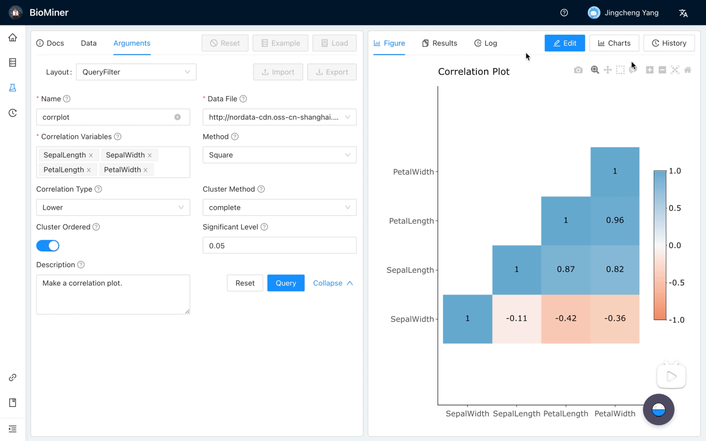

# BioMiner Studio

A Miner Studio for BioMedical Knownledges.

<a href="https://www.bilibili.com/video/BV1B341117UQ/" target="_blank" alt="Welcome to BioMiner">
  
</a>

## For Users

Comming soon...

## For Developers

Install `node_modules`:

```bash
npm install
```

or

```bash
yarn
```

## Provided Scripts

Ant Design Pro provides some useful script to help you quick start and build with web project, code style check and test.

Scripts provided in `package.json`. It's safe to modify or add additional script:

### Start project

```bash
npm start
```

### Build project

```bash
npm run build
```

### Check code style

```bash
npm run lint
```

You can also use script to auto fix some lint error:

```bash
npm run lint:fix
```

### Test code

```bash
npm test
```
